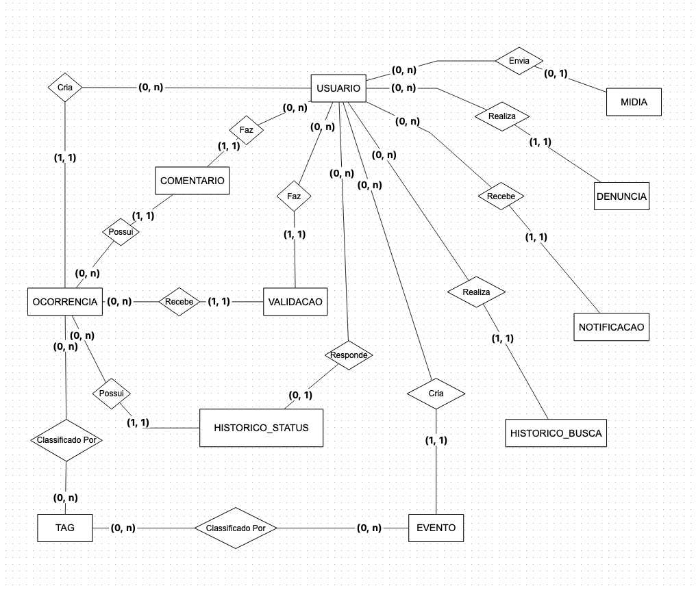

# Modelagem Lógica do Banco de Dados

## Visão Geral

O modelo lógico traduz as entidades e relacionamentos do modelo conceitual em tabelas relacionais, definindo tipos de dados, chaves primárias (PK), chaves estrangeiras (FK) e restrições de integridade. O modelo é independente de banco de dados específico, mas segue a notação SQL padrão.

A tabela `usuario` utiliza a **matrícula universitária** como chave primária natural, sendo ela propagada como chave estrangeira nas demais tabelas sob o nome `usuario_matricula`.

---

## Visualização do Diagrama

<iframe
  src="https://dbdiagram.io/e/6a0f5dccdfb20dafcdc44014/6a0f5dd2b62396d22c3f9ef9"
  width="100%"
  height="700"
  style="border: 1px solid #ddd; border-radius: 8px;"
></iframe>

---

## Modelo Entidade-Relacionamento




---


## Descrição das Tabelas

### `usuario`
Armazena os dados de cadastro e autenticação de cada membro da plataforma. A matrícula universitária é usada como chave primária natural.

| Coluna | Tipo | Restrições | Descrição |
|---|---|---|---|
| matricula | VARCHAR(20) | PK, NOT NULL | Matrícula universitária (ex: 211066196) |
| nome | VARCHAR(100) | NOT NULL | Nome completo |
| email | VARCHAR(255) | UNIQUE, NOT NULL | Endereço de e-mail |
| senha_hash | VARCHAR(255) | NOT NULL | Hash da senha (ex: bcrypt) |
| tipo | VARCHAR(10) | NOT NULL | `membro` ou `admin` |
| status | VARCHAR(10) | NOT NULL | `ativo`, `inativo` ou `pendente` |
| email_verificado | BOOLEAN | NOT NULL, DEFAULT false | Status de verificação de e-mail |
| created_at | TIMESTAMP | NOT NULL | Data de criação da conta |
| updated_at | TIMESTAMP | NOT NULL | Data da última atualização |

---

### `ocorrencia`
Armazena os registros de problemas de segurança e infraestrutura com geolocalização.

| Coluna | Tipo | Restrições | Descrição |
|---|---|---|---|
| id | UUID | PK, NOT NULL | Identificador único |
| titulo | VARCHAR(200) | NOT NULL | Título da ocorrência |
| descricao | TEXT | — | Descrição detalhada |
| tipo | VARCHAR(20) | NOT NULL | Categoria do problema |
| status | VARCHAR(15) | NOT NULL, DEFAULT `pendente` | Estado atual |
| prioridade | VARCHAR(10) | NOT NULL, DEFAULT `media` | Nível de urgência |
| latitude | DECIMAL(10,8) | NOT NULL | Latitude da ocorrência |
| longitude | DECIMAL(11,8) | NOT NULL | Longitude da ocorrência |
| anonimo | BOOLEAN | NOT NULL, DEFAULT false | Reporte anônimo |
| usuario_matricula | VARCHAR(20) | FK → `usuario.matricula`, NULLABLE | Autor (nulo se anônimo) |
| created_at | TIMESTAMP | NOT NULL | Data do registro |
| updated_at | TIMESTAMP | NOT NULL | Última atualização |

---

### `evento`
Armazena os eventos acadêmicos, culturais e esportivos publicados no mapa.

| Coluna | Tipo | Restrições | Descrição |
|---|---|---|---|
| id | UUID | PK, NOT NULL | Identificador único |
| titulo | VARCHAR(200) | NOT NULL | Nome do evento |
| descricao | TEXT | — | Descrição detalhada |
| categoria | VARCHAR(15) | NOT NULL | Tipo do evento |
| data_inicio | TIMESTAMP | NOT NULL | Data/hora de início |
| data_fim | TIMESTAMP | — | Data/hora de encerramento |
| latitude | DECIMAL(10,8) | NOT NULL | Latitude do local |
| longitude | DECIMAL(11,8) | NOT NULL | Longitude do local |
| link_externo | VARCHAR(500) | — | URL com mais informações |
| status | VARCHAR(10) | NOT NULL, DEFAULT `ativo` | Estado do evento |
| usuario_matricula | VARCHAR(20) | FK → `usuario.matricula`, NOT NULL | Autor do evento |
| created_at | TIMESTAMP | NOT NULL | Data de cadastro |
| updated_at | TIMESTAMP | NOT NULL | Última atualização |

---

### `midia`
Armazena referências para arquivos de imagem vinculados a ocorrências ou eventos.

| Coluna | Tipo | Restrições | Descrição |
|---|---|---|---|
| id | UUID | PK, NOT NULL | Identificador único |
| url | VARCHAR(500) | NOT NULL | Caminho/URL do arquivo |
| tipo | VARCHAR(10) | NOT NULL, DEFAULT `imagem` | Tipo de arquivo |
| entidade_tipo | VARCHAR(15) | NOT NULL | `ocorrencia` ou `evento` |
| entidade_id | UUID | NOT NULL | ID do registro pai |
| usuario_matricula | VARCHAR(20) | FK → `usuario.matricula`, NULLABLE | Usuário que fez o upload |
| created_at | TIMESTAMP | NOT NULL | Data do envio |

---

### `comentario`
Armazena os comentários de usuários em ocorrências.

| Coluna | Tipo | Restrições | Descrição |
|---|---|---|---|
| id | UUID | PK, NOT NULL | Identificador único |
| conteudo | TEXT | NOT NULL | Texto do comentário |
| usuario_matricula | VARCHAR(20) | FK → `usuario.matricula`, NOT NULL | Autor |
| ocorrencia_id | UUID | FK → `ocorrencia.id`, NOT NULL | Ocorrência comentada |
| created_at | TIMESTAMP | NOT NULL | Data de publicação |
| updated_at | TIMESTAMP | NOT NULL | Última edição |

---

### `validacao`
Armazena os upvotes de usuários em ocorrências, confirmando sua veracidade.

| Coluna | Tipo | Restrições | Descrição |
|---|---|---|---|
| id | UUID | PK, NOT NULL | Identificador único |
| usuario_matricula | VARCHAR(20) | FK → `usuario.matricula`, NOT NULL | Usuário que validou |
| ocorrencia_id | UUID | FK → `ocorrencia.id`, NOT NULL | Ocorrência validada |
| created_at | TIMESTAMP | NOT NULL | Data da validação |

> **Índice único:** `(usuario_matricula, ocorrencia_id)` — impede validações duplicadas do mesmo usuário.

---

### `historico_status`
Registra cada transição de status de uma ocorrência para auditoria completa.

| Coluna | Tipo | Restrições | Descrição |
|---|---|---|---|
| id | UUID | PK, NOT NULL | Identificador único |
| ocorrencia_id | UUID | FK → `ocorrencia.id`, NOT NULL | Ocorrência afetada |
| status_anterior | VARCHAR(15) | NULLABLE | Status antes da mudança |
| status_novo | VARCHAR(15) | NOT NULL | Novo status atribuído |
| responsavel_matricula | VARCHAR(20) | FK → `usuario.matricula`, NULLABLE | Responsável pela mudança |
| observacao | TEXT | — | Justificativa ou nota |
| created_at | TIMESTAMP | NOT NULL | Momento da mudança |

---

### `tag`
Armazena palavras-chave utilizadas para categorizar e facilitar a busca de registros.

| Coluna | Tipo | Restrições | Descrição |
|---|---|---|---|
| id | UUID | PK, NOT NULL | Identificador único |
| nome | VARCHAR(50) | UNIQUE, NOT NULL | Texto da tag |
| created_at | TIMESTAMP | NOT NULL | Data de criação |

---

### `ocorrencia_tag`
Tabela de junção para o relacionamento N:M entre `ocorrencia` e `tag`.

| Coluna | Tipo | Restrições | Descrição |
|---|---|---|---|
| ocorrencia_id | UUID | PK, FK → `ocorrencia.id` | Referência à ocorrência |
| tag_id | UUID | PK, FK → `tag.id` | Referência à tag |

---

### `evento_tag`
Tabela de junção para o relacionamento N:M entre `evento` e `tag`.

| Coluna | Tipo | Restrições | Descrição |
|---|---|---|---|
| evento_id | UUID | PK, FK → `evento.id` | Referência ao evento |
| tag_id | UUID | PK, FK → `tag.id` | Referência à tag |

---

### `denuncia`
Armazena as denúncias de conteúdo inadequado ou falso realizadas por usuários.

| Coluna | Tipo | Restrições | Descrição |
|---|---|---|---|
| id | UUID | PK, NOT NULL | Identificador único |
| motivo | TEXT | NOT NULL | Descrição do motivo |
| usuario_matricula | VARCHAR(20) | FK → `usuario.matricula`, NOT NULL | Usuário que denunciou |
| entidade_tipo | VARCHAR(15) | NOT NULL | `ocorrencia`, `evento` ou `comentario` |
| entidade_id | UUID | NOT NULL | ID do conteúdo denunciado |
| status | VARCHAR(10) | NOT NULL, DEFAULT `pendente` | Estado da análise |
| created_at | TIMESTAMP | NOT NULL | Data da denúncia |

---

### `notificacao`
Armazena as notificações geradas pelo sistema para os usuários.

| Coluna | Tipo | Restrições | Descrição |
|---|---|---|---|
| id | UUID | PK, NOT NULL | Identificador único |
| usuario_matricula | VARCHAR(20) | FK → `usuario.matricula`, NOT NULL | Destinatário |
| mensagem | TEXT | NOT NULL | Conteúdo da notificação |
| lida | BOOLEAN | NOT NULL, DEFAULT false | Status de leitura |
| entidade_tipo | VARCHAR(15) | NULLABLE | `ocorrencia`, `evento` ou `comentario` |
| entidade_id | UUID | NULLABLE | ID do registro de origem |
| created_at | TIMESTAMP | NOT NULL | Data de criação |

---

### `historico_busca`
Registra o histórico de buscas realizadas por usuários autenticados.

| Coluna | Tipo | Restrições | Descrição |
|---|---|---|---|
| id | UUID | PK, NOT NULL | Identificador único |
| usuario_matricula | VARCHAR(20) | FK → `usuario.matricula`, NOT NULL | Usuário que buscou |
| query | VARCHAR(500) | NOT NULL | Termo pesquisado |
| filtros | JSON | NULLABLE | Filtros aplicados (tipo, data, localização) |
| created_at | TIMESTAMP | NOT NULL | Data da busca |

---

## Resumo das Chaves Estrangeiras

| Tabela | Coluna | Referencia |
|---|---|---|
| `ocorrencia` | `usuario_matricula` | `usuario.matricula` |
| `evento` | `usuario_matricula` | `usuario.matricula` |
| `midia` | `usuario_matricula` | `usuario.matricula` |
| `comentario` | `usuario_matricula` | `usuario.matricula` |
| `comentario` | `ocorrencia_id` | `ocorrencia.id` |
| `validacao` | `usuario_matricula` | `usuario.matricula` |
| `validacao` | `ocorrencia_id` | `ocorrencia.id` |
| `historico_status` | `ocorrencia_id` | `ocorrencia.id` |
| `historico_status` | `responsavel_matricula` | `usuario.matricula` |
| `ocorrencia_tag` | `ocorrencia_id` | `ocorrencia.id` |
| `ocorrencia_tag` | `tag_id` | `tag.id` |
| `evento_tag` | `evento_id` | `evento.id` |
| `evento_tag` | `tag_id` | `tag.id` |
| `denuncia` | `usuario_matricula` | `usuario.matricula` |
| `notificacao` | `usuario_matricula` | `usuario.matricula` |
| `historico_busca` | `usuario_matricula` | `usuario.matricula` |

---

## Diagrama (DBML)

O código abaixo pode ser importado no [dbdiagram.io](https://dbdiagram.io) para recriar o esquema visualmente.

```dbml
Table usuario {
  matricula    varchar(20)  [pk, not null, note: "Matrícula universitária (ex: 211066196)"]
  nome         varchar(100) [not null]
  email        varchar(255) [unique, not null]
  senha_hash   varchar(255) [not null]
  tipo         varchar(10)  [not null, note: "membro | admin"]
  status       varchar(10)  [not null, note: "ativo | inativo | pendente"]
  email_verificado boolean  [not null, default: false]
  created_at   timestamp    [not null]
  updated_at   timestamp    [not null]
}

Table ocorrencia {
  id                 uuid         [pk, not null]
  titulo             varchar(200) [not null]
  descricao          text
  tipo               varchar(20)  [not null, note: "iluminacao | seguranca_fisica | vandalismo | infraestrutura | outro"]
  status             varchar(15)  [not null, default: "pendente", note: "pendente | em_andamento | resolvido | arquivado"]
  prioridade         varchar(10)  [not null, default: "media", note: "baixa | media | alta | critica"]
  latitude           decimal(10,8) [not null]
  longitude          decimal(11,8) [not null]
  anonimo            boolean      [not null, default: false]
  usuario_matricula  varchar(20)  [ref: > usuario.matricula]
  created_at         timestamp    [not null]
  updated_at         timestamp    [not null]
}

Table evento {
  id                 uuid         [pk, not null]
  titulo             varchar(200) [not null]
  descricao          text
  categoria          varchar(15)  [not null, note: "academico | cultural | esportivo | social | outro"]
  data_inicio        timestamp    [not null]
  data_fim           timestamp
  latitude           decimal(10,8) [not null]
  longitude          decimal(11,8) [not null]
  link_externo       varchar(500)
  status             varchar(10)  [not null, default: "ativo", note: "ativo | cancelado | encerrado"]
  usuario_matricula  varchar(20)  [ref: > usuario.matricula, not null]
  created_at         timestamp    [not null]
  updated_at         timestamp    [not null]
}

Table midia {
  id                 uuid         [pk, not null]
  url                varchar(500) [not null]
  tipo               varchar(10)  [not null, default: "imagem", note: "imagem | video"]
  entidade_tipo      varchar(15)  [not null, note: "ocorrencia | evento"]
  entidade_id        uuid         [not null]
  usuario_matricula  varchar(20)  [ref: > usuario.matricula]
  created_at         timestamp    [not null]
}

Table comentario {
  id                 uuid         [pk, not null]
  conteudo           text         [not null]
  usuario_matricula  varchar(20)  [ref: > usuario.matricula, not null]
  ocorrencia_id      uuid         [ref: > ocorrencia.id, not null]
  created_at         timestamp    [not null]
  updated_at         timestamp    [not null]
}

Table validacao {
  id                 uuid         [pk, not null]
  usuario_matricula  varchar(20)  [ref: > usuario.matricula, not null]
  ocorrencia_id      uuid         [ref: > ocorrencia.id, not null]
  created_at         timestamp    [not null]

  indexes {
    (usuario_matricula, ocorrencia_id) [unique]
  }
}

Table historico_status {
  id                      uuid         [pk, not null]
  ocorrencia_id           uuid         [ref: > ocorrencia.id, not null]
  status_anterior         varchar(15)
  status_novo             varchar(15)  [not null]
  responsavel_matricula   varchar(20)  [ref: > usuario.matricula]
  observacao              text
  created_at              timestamp    [not null]
}

Table tag {
  id         uuid        [pk, not null]
  nome       varchar(50) [unique, not null]
  created_at timestamp   [not null]
}

Table ocorrencia_tag {
  ocorrencia_id uuid [ref: > ocorrencia.id, not null]
  tag_id        uuid [ref: > tag.id, not null]

  indexes {
    (ocorrencia_id, tag_id) [pk]
  }
}

Table evento_tag {
  evento_id uuid [ref: > evento.id, not null]
  tag_id    uuid [ref: > tag.id, not null]

  indexes {
    (evento_id, tag_id) [pk]
  }
}

Table denuncia {
  id                 uuid         [pk, not null]
  motivo             text         [not null]
  usuario_matricula  varchar(20)  [ref: > usuario.matricula, not null]
  entidade_tipo      varchar(15)  [not null, note: "ocorrencia | evento | comentario"]
  entidade_id        uuid         [not null]
  status             varchar(10)  [not null, default: "pendente", note: "pendente | analisada | arquivada"]
  created_at         timestamp    [not null]
}

Table notificacao {
  id                 uuid         [pk, not null]
  usuario_matricula  varchar(20)  [ref: > usuario.matricula, not null]
  mensagem           text         [not null]
  lida               boolean      [not null, default: false]
  entidade_tipo      varchar(15)  [note: "ocorrencia | evento | comentario"]
  entidade_id        uuid
  created_at         timestamp    [not null]
}

Table historico_busca {
  id                 uuid         [pk, not null]
  usuario_matricula  varchar(20)  [ref: > usuario.matricula, not null]
  query              varchar(500) [not null]
  filtros            json
  created_at         timestamp    [not null]
}
```
